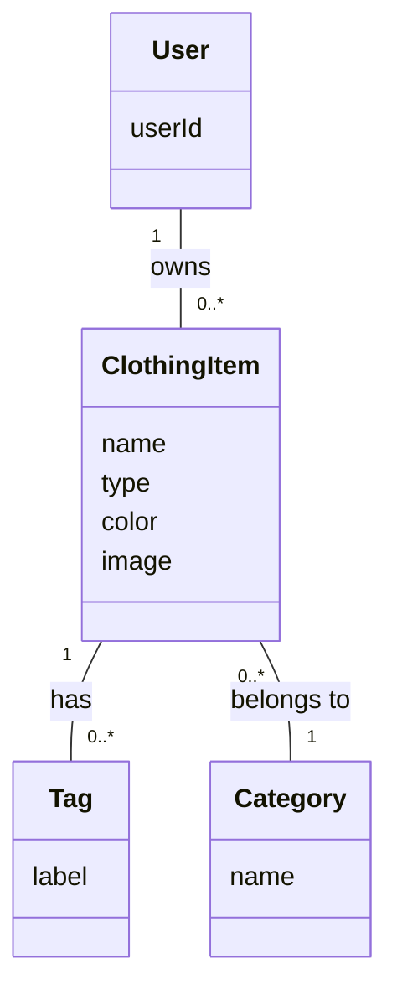
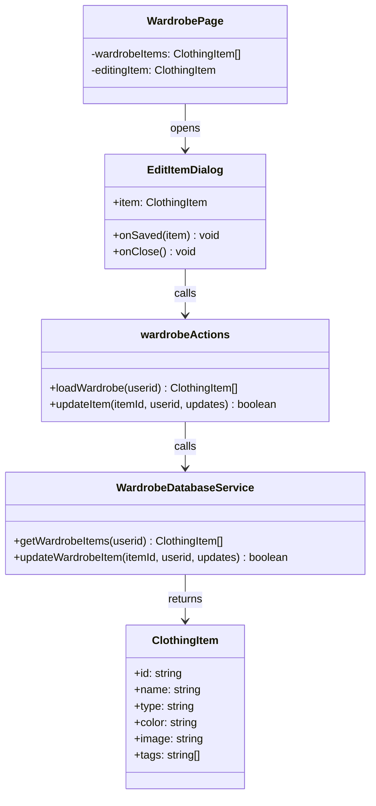
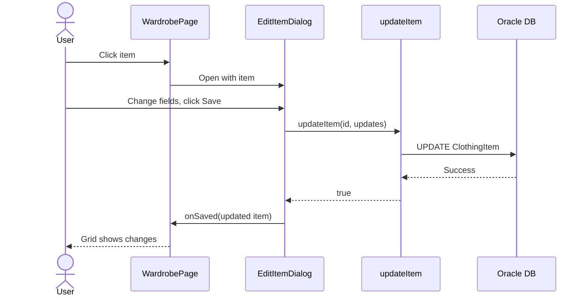
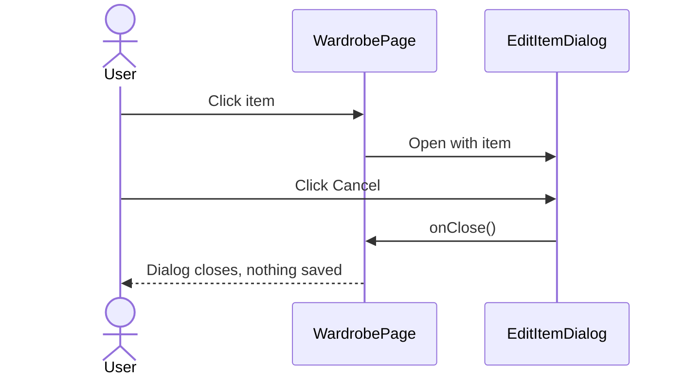

### 1. Conceptual Class Diagram

```mermaid
classDiagram
    class User {
        userId
    }
    class ClothingItem {
        name
        type
        color
        image
    }
    class Tag {
        label
    }
    class Category {
        name
    }
 
    User "1" -- "0..*" ClothingItem : owns
    ClothingItem "1" -- "0..*" Tag : has
    ClothingItem "0..*" -- "1" Category : belongs to
```
### 2. Detailed Class

```mermaid
classDiagram
    class ClothingItem {
        +id: string
        +name: string
        +type: string
        +color: string
        +image: string
        +tags: string[]
    }
    class WardrobePage {
        -wardrobeItems: ClothingItem[]
        -editingItem: ClothingItem
    }
    class EditItemDialog {
        +item: ClothingItem
        +onSaved(item) void
        +onClose() void
    }
    class wardrobeActions {
        +loadWardrobe(userid) ClothingItem[]
        +updateItem(itemId, userid, updates) boolean
    }
    class WardrobeDatabaseService {
        +getWardrobeItems(userid) ClothingItem[]
        +updateWardrobeItem(itemId, userid, updates) boolean
    }
 
    WardrobePage --> EditItemDialog : opens
    EditItemDialog --> wardrobeActions : calls
    wardrobeActions --> WardrobeDatabaseService : calls
    WardrobeDatabaseService --> ClothingItem : returns
 

```
### 3. Sequence Diagram - Editing a Item

```mermaid
sequenceDiagram
    actor User
    participant Page as WardrobePage
    participant Dialog as EditItemDialog
    participant Server as updateItem
    participant DB as Oracle DB
 
    User->>Page: Click item
    Page->>Dialog: Open with item
    User->>Dialog: Change fields, click Save
    Dialog->>Server: updateItem(id, updates)
    Server->>DB: UPDATE ClothingItem
    DB-->>Server: Success
    Server-->>Dialog: true
    Dialog->>Page: onSaved(updated item)
    Page-->>User: Grid shows changes

```
### 4. Sequence Diagram - Opening without editing

```mermaid
sequenceDiagram
    actor User
    participant Page as WardrobePage
    participant Dialog as EditItemDialog
 
    User->>Page: Click item
    Page->>Dialog: Open with item
    User->>Dialog: Click Cancel
    Dialog->>Page: onClose()
    Page-->>User: Dialog closes, nothing saved
```
